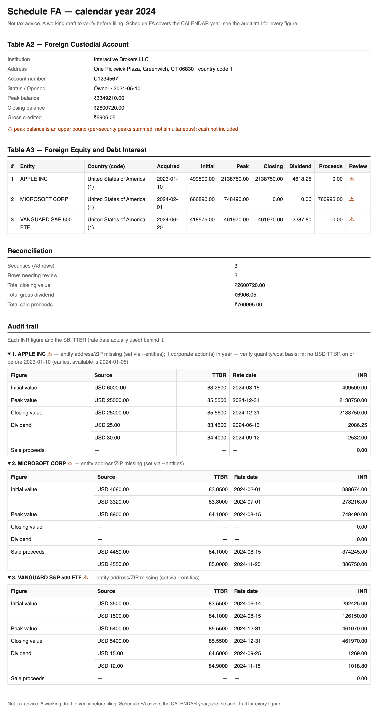
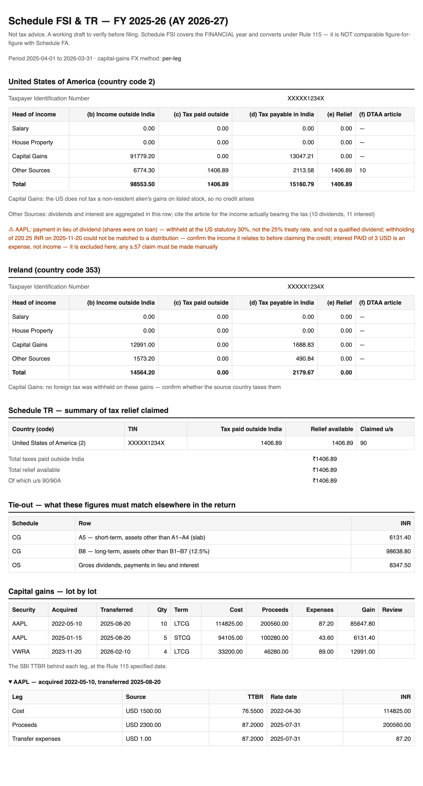

# schedule-fa

A Go CLI that turns **Interactive Brokers (IBKR)** holdings into ready-to-use Indian ITR
schedules, with a full audit trail behind every figure:

- **`generate`** → **Schedule FA** (Foreign Assets): the **calendar** year, SBI TT buying rate
  on each event date, and peak/closing/initial values per security. Markdown, CSV, JSON and a
  printable HTML.
- **`fsi`** → **Schedule FSI + Schedule TR** and a **Form 67** worksheet: the Apr–Mar
  **financial** year, capital gains and other-source income computed under **Rule 115**
  (and foreign tax under Rule 128(8)), with the foreign tax credit worked out per country.
  Markdown, CSV, JSON, a printable HTML, plus a fragment in the ITD's own ITR-2 JSON
  field names.

> The two schedules are **not** comparable figure-for-figure: different period, different
> exchange-rate rule. Run both — the FSI report prints the tie-out figures you need.

See [`docs/schedule-fa-ibkr-plan.md`](docs/schedule-fa-ibkr-plan.md) for the research,
challenges, decisions, architecture, and milestones.

> **Disclaimer:** Not tax advice. The output is a working draft to verify (ideally with a
> CA) before filing. You remain responsible for what you file.

## Getting your data from IBKR

You need an **Activity Flex Query** (it defines what goes in the statement). Then either
**download its XML** (offline) or pull it via the **Flex Web Service** with a token (online).
Menu names differ slightly across IBKR's portal versions — both are given below.

### Step 1 — Create the Activity Flex Query

1. Log in to **IBKR Client Portal** (<https://www.interactivebrokers.com> → Login).
2. Open **Performance & Reports → Flex Queries** (older menu: **Reports → Flex Queries**).
3. Next to **Activity Flex Query**, click the **＋** (Create).
4. Name it e.g. `ScheduleFA`. Set:
   - **Format:** `XML`
   - **Period:** `Last Calendar Year` (or `Custom` with the range **Jan 1 – Dec 31** of the
     tax year — Schedule FA is on the **calendar** year, not the Apr–Mar financial year)
   - **Date Format:** leave the default (`yyyyMMdd`)
5. Turn on these **sections** (open each, then "Select All" fields — extra fields are
   ignored by the tool, so over-selecting is safe):
   - **Account Information**
   - **Open Positions** — set the option **Lot Details = Yes** (a.k.a. "Position Lots")
   - **Trades** (Executions) — for `fsi`, also tick **Closed Lots**, which is what carries the
     realized gain, the acquisition date and the cost basis of lots bought in earlier years.
     Without it capital gains cannot be computed and the tool says so.
   - **Cash Transactions** — include types **Dividends**, **Payment In Lieu Of Dividends**,
     **Withholding Tax** and **Broker Interest Received/Paid**
   - **Corporate Actions** (optional — lets the tool flag splits/mergers)
   - **Financial Instrument Information** (a.k.a. **Securities Info**)
6. **Save** the query.

> **Period.** Schedule FA needs **Jan 1 – Dec 31**; Schedule FSI needs **Apr 1 – Mar 31**. Either
> keep two queries, or use one **Custom** range wide enough for both and let the tool window it
> (it drops anything dated outside the period you ask for).

### Step 2a — Offline: download the XML

On the Flex Queries page, click the query's **Run** (▶) icon → pick the year → **Download**
the XML. Save it under `schedule-fa/private/` (gitignored), then use `--statement`.

### Step 2b — Online: token + Query ID (no manual download)

- **Query ID** — on the Flex Queries page the ID is the number shown beside the query (e.g.
  `123456`); it's also in the query's edit screen. Pass it as `--flex-query`.
- **Token** — open **Settings → Account Settings → Flex Web Service** (older menu:
  **Reports → Settings → Flex Web Service Configuration**). Click **Configure**, set status
  **Active**, pick a token validity period, and **Generate**. Copy the long token string
  (shown once). Pass it as `--flex-token`. One token works for all your Flex Queries.

> **Treat the token like a password** — it grants read access to your statements. Don't
> commit it; prefer an env var (e.g. `--flex-token "$IBKR_FLEX_TOKEN"`).

---

## Generating Schedule FA (foreign assets)

```sh
# (one-time) build the CLI from the schedule-fa/ directory
go build -o schedulefa ./cmd/schedulefa

# 1. SBI TTBR rates  (see data/ttbr/README.md)
curl -L -o data/ttbr/SBI_REFERENCE_RATES_USD.csv \
  https://raw.githubusercontent.com/sahilgupta/sbi-fx-ratekeeper/main/csv_files/SBI_REFERENCE_RATES_USD.csv

# 2. Daily prices for the exact peak  (edit data/prices/tickers.txt first; see data/prices/README.md)
./schedulefa fetch-prices --year 2026
```

**Offline** (downloaded XML):

```sh
./schedulefa generate \
  --year 2026 \                                    # CALENDAR year (Jan 1–Dec 31), enforced
  --statement private/flex-2026.xml \
  --rates data/ttbr/SBI_REFERENCE_RATES_USD.csv \
  --prices data/prices/prices-2026.csv \           # omit → approximate peak (mode C)
  --entities data/entities/entities.csv \          # address/ZIP/country-code overrides
  --out private/report --format md,csv,json,html
```

**Online** (Flex Web Service — no manual download):

```sh
./schedulefa generate --year 2026 \
  --flex-token "$IBKR_FLEX_TOKEN" --flex-query 123456 \
  --save-statement private/flex-2026.xml \         # optional: keep a copy of the raw XML
  --rates data/ttbr/SBI_REFERENCE_RATES_USD.csv \
  --prices data/prices/prices-2026.csv \
  --entities data/entities/entities.csv \
  --out private/report --format md,csv,html
```

Outputs land in `--out` (default `private/report/`): `report.md`, `report.csv`,
`report.json`, `report.html`. **For a PDF**, open `report.html` in a browser and choose
**Print → Save as PDF** (the page has print-tuned styling). The **CSV** is for transcribing
into the ITR utility; the **Markdown/HTML** carry a per-figure audit trail (source amount,
TTBR, and the exact rate date used) and a reconciliation summary.

<p align="center">
  
</p>

*(Rendered from the synthetic fixture — no real holdings. The full example lives in
[`internal/pipeline/testdata/golden/report.html`](internal/pipeline/testdata/golden/report.html).)*

> Keep real Flex exports and reports under `private/` (gitignored) — they contain your
> account number, address, and holdings, and must never be committed. Use a **complete past
> calendar year** export for a real filing (a year-to-date export is only a partial draft).

---

## Generating Schedule FSI + TR (foreign income and tax relief)

```sh
./schedulefa fsi \
  --fy 2025-26 \                                  # FINANCIAL year (1 Apr–31 Mar), enforced
  --statement private/flex-fy2025-26.xml \
  --rates data/ttbr/SBI_REFERENCE_RATES_USD.csv \
  --entities data/entities/entities.csv \
  --tin XXXXX1234X \                              # your TIN in the source country
  --marginal-rate 30 --surcharge 0 --cess 4 \     # your Indian slab assumptions
  --out private/report --format md,csv,json,html
```

Outputs `report-fsi.md` / `.csv` / `.json` / `.html` plus `schedule-fsi.json` — a fragment using the ITD
ITR-2 schema's own field names (`ScheduleFSIDtls`, `ScheduleTR1`) in whole rupees, validated
against that schema. The utility cannot import a single schedule, so the **CSV/Markdown tables
are what you transcribe**; the fragment is for anyone assembling a full ITR JSON by hand. The
HTML is styled to match the Schedule FA report, so **Print → Save as PDF** on both gives one
consistent pack to hand a CA.

<p align="center">
  
</p>

*(Rendered from the synthetic fixture — no real holdings. The full example lives in
[`internal/pipeline/testdata/golden/report-fsi.html`](internal/pipeline/testdata/golden/report-fsi.html).)*

### The three inputs only you can supply

| Flag                                       | Why it cannot be derived from a broker statement                                                                                                                                                                                             |
|--------------------------------------------|----------------------------------------------------------------------------------------------------------------------------------------------------------------------------------------------------------------------------------------------|
| `--tin`                                    | Your identification number in the source country. If none was allotted, the ITD guide says use your passport number.                                                                                                                         |
| `--marginal-rate`, `--surcharge`, `--cess` | Column (d), "tax payable on such income under normal provisions in India", depends on your **total** income, regime and slab — not on this statement. The tool never guesses: it applies what you pass and prints it as a stated assumption. |
| `--cg-fx`                                  | How to apply Rule 115 to a capital gain is a genuine interpretive fork (see below).                                                                                                                                                          |

### Decisions the tool makes, and how to change them

- **Rule 115, not the Schedule FA convention.** Income converts at the SBI TTBR of the **last
  day of the month before** the month of the event (31 March for other income such as broker
  interest); foreign tax converts under **Rule 128(8)** at the month end before it was
  deducted. A month end that fell on a weekend or holiday falls back to the preceding
  published day, and every figure shows the rate date actually used.
- **Capital-gains FX method** (`--cg-fx`): `per-leg` (default) converts cost at the acquisition
  month and proceeds at the transfer month, so rupee depreciation lands inside the taxable
  gain — a resident gets no currency shelter, since the first proviso to s.48 and Rule 115A are
  non-resident-only. `net-gain` computes the gain in dollars and converts it once. Both are in
  live practitioner use and they differ materially; the choice is printed in the report.
- **Foreign shares are not "listed securities"** for Indian tax: long term after **24 months**
  (not 12), taxed at **12.5% without indexation** under s.112, no ₹1.25 lakh exemption, and
  short-term at slab rates. Gains land in Schedule CG rows **A5** and **B8**. Transfers before
  23 Jul 2024 fall in the old 20%-with-indexation regime — those are separated out and flagged,
  because the tool does not compute indexation.
- **Relief** is the lower of the foreign tax and the Indian tax on the same income, per country
  per head. Excess foreign tax is **not** carried forward.

### What it deliberately does not do

Salary (RSU perquisite) and House Property rows are emitted empty — an IBKR statement is no
evidence of them. Set-off and carry-forward of losses (Schedule CFL), indexation, and the ESPP
discount are out of scope and flagged rather than guessed. A capital **loss** never appears as
negative income in column (b); it is flagged for Schedule CG instead.

---

## Status

All milestones complete (M0–M8):

- **M1 — Ingest** — parse a downloaded Activity Flex XML (account, lot-detailed positions,
  trades, dividends with withholding matched), constrained to the calendar year.
- **M2 — FX** — SBI FX RateKeeper TTBR data; INR conversion with preceding-working-day
  fallback and per-figure audit records.
- **M3 — Table A3 + reports** — A3 rows (initial/peak/closing/dividend/proceeds in INR) with
  audit trail and review flags; Markdown / CSV / JSON renderers.
- **M5 — Table A2 + edge cases** — custodial-account row; `--entities` metadata override;
  RSU vesting dates; corporate-action flags; ITR country codes (US=2, Canada=1 — the ITD
  list is ISD-derived but disambiguates the shared +1).
- **M4 — Exact peak** — `--prices` enables mode B (daily share reconstruction × daily price
  × TTBR) plus a true Table A2 peak (max daily NAV). Mode C is the fallback.
- **M6 — Flex Web Service** — `--flex-token` + `--flex-query` online pull; `--save-statement`.
- **M7 — HTML** — printable, self-contained `report.html` (Print → Save as PDF).
- **M8 — Schedule FSI + TR** — financial-year ingest (closed lots, interest, payments in lieu,
  unattributed withholding); Rule 115 / Rule 128(8) conversion; a capital-gains engine
  (24-month term, 23-Jul-2024 rate split, per-leg vs net-gain FX); the country × head FSI grid
  with relief; Schedule TR; a Form 67 worksheet; a printable HTML matching the FA report; and
  an ITD-schema-shaped JSON fragment.

## Build & test

```sh
go build ./cmd/schedulefa      # from schedule-fa/
go test ./...
```

Complete example reports in every format live in
[`internal/pipeline/testdata/golden/`](internal/pipeline/testdata/golden/) — Schedule FA as
[`report.md`](internal/pipeline/testdata/golden/report.md),
[`report.csv`](internal/pipeline/testdata/golden/report.csv),
[`report.json`](internal/pipeline/testdata/golden/report.json) and
[`report.html`](internal/pipeline/testdata/golden/report.html); Schedule FSI as
[`report-fsi.md`](internal/pipeline/testdata/golden/report-fsi.md),
[`report-fsi.csv`](internal/pipeline/testdata/golden/report-fsi.csv),
[`report-fsi.json`](internal/pipeline/testdata/golden/report-fsi.json),
[`report-fsi.html`](internal/pipeline/testdata/golden/report-fsi.html) and
[`schedule-fsi.json`](internal/pipeline/testdata/golden/schedule-fsi.json).

These are the golden fixtures the offline pipeline is tested against, so they always reflect the
tool's current output. Refresh them with `go test ./internal/pipeline -update` and **review the
diff** before committing.
